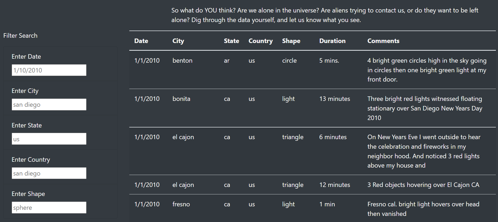

# UFOs
Click to view the app.js and HTML file [app.js](https://github.com/pranavspatel/UFOs/blob/main/static/js/app.js) | [HTML file](https://github.com/pranavspatel/UFOs/blob/main/index.html) 

## Overview of Analysis
The aim is to create a webpage with a dynamic table that shows the results of the UFO sightings data. We have added more filters for the table such as city, state, country, and shape.

## Results
Previously, the webpage only had a date filter in which users neede to click on a button for the filter to be applied. Now we have updated the app with more filters. The webpage will then automatically update based on the filters applied. The first image illustrates the table without the filters. Upon input, the table will automatically filter the results accordingly.

## Summary of Analysis
One drawback is that the webpage is not able to resize, maybe we can adjust the sections and margins when the page is viewed.

We can attach a survey form and can receive inputs from the users and can add the viewing to our database and keep the information upto date.
